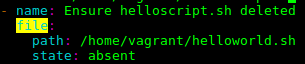
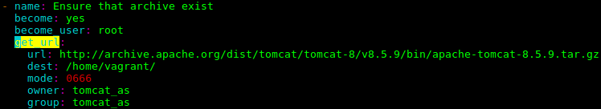
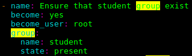
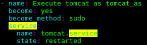
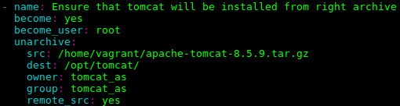
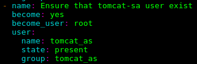

# ansible
Use following modules (at least):  
copy  

file

get_url  

group  

service  

shell  

unarchive  

user  

yum  

Define play variables (at least):  

tomcat_version  

java_version  
